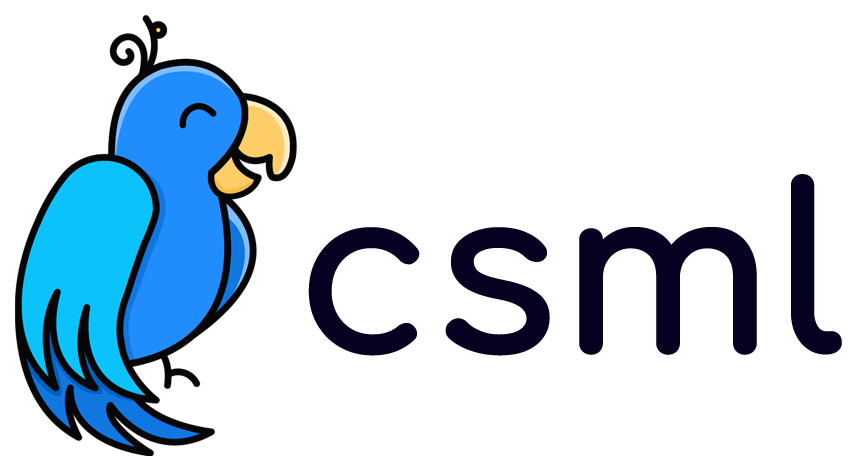

# CSML Language



## Introduction

The CSML (Conversational Standard Meta Language) is a Domain-Specific Language developed for creating conversational experiences easily.

The purpose of this language is to simplify the creation and maintenance of rich conversational interactions between humans and machines. With a very expressive and text-only syntax, CSML flows are easy to understand, making it easy to deploy and maintain conversational agents. The CSML handles short and long-term memory slots, metadata injection, and connecting to any third party API or injecting arbitrary code in any programming language thanks to its powerful runtime APIs.

By using the CSML language, any developer can integrate arbitrarily complex conversational agents on any channel (Facebook Messenger, Slack, Facebook Workplace, Microsoft Teams, custom webapp, ...) and make any bot available to any end user. The CSML platform comes with a large number of channel integrations that work out of the box, but developers are free to add new custom integrations by using the CSML interfaces.

## Functional diagram


## Examples

### Hello World

    cargo run --example hello_world

### Event

    cargo run --example event

### Metadata

    cargo run --example metadata

### Memory

    cargo run --example memory

## Quick Start run it yourself

 requires Rust version 1.41.

```rust

use std::fs;
use csmlinterpreter::{data::ContextJson, interpret};

fn interpret_flow(flow: &str, step_name: &str) {
    let event = Event::text("hello");
    let context = ContextJson::new();

    dbg!(interpret(
        flow, step_name, context, &event, None
    ));
}

fn main() {
    // add a valid path to a csml file
    let flow = fs::read_to_string("./hello_world.csml").unwrap();

    interpret_flow(&flow, "start");
}
```

## Additional Information

### Getting Help

* [Slack] - Direct questions about using the language.
* [CSML Documentation](https://docs.csml.dev) - Getting started.

[Slack]: https://csml-by-clevy.slack.com/join/shared_invite/enQtODAxMzY2MDQ4Mjk0LWZjOTZlODI0YTMxZTg4ZGIwZDEzYTRlYmU1NmZjYWM2MjAwZTU5MmU2NDdhNmU2N2Q5ZTU2ZTcxZDYzNTBhNTc

### Information

* [Roadmap](https://trello.com/b/tZ1MoALL/csml-open-roadmap) - Upcoming new features.
* [Release notes](https://headwayapp.co/csml-release-notes) - Stay up to date.

### Play with the language

* [Studio] - Create and deploy your chatbot in a matter of minutes.

[Studio]: https://studio.csml.dev
