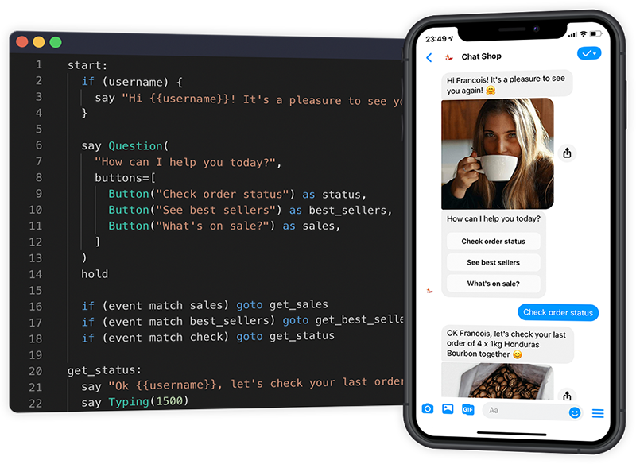

<h1 align="center">
  <br>
  <a href="https://www.csml.dev"></a>
  <br>

</h1>

<h4 align="center">First programming language dedicated to building chatbots.</h4>

<p align="center">
  
  <a href="https://github.com/CSML-by-Clevy/csml-engine/releases/latest"></a>
  <a href="https://hub.docker.com/r/clevy/csml-engine"></a>
  <a href="https://join.slack.com/t/csml-by-clevy/shared_invite/enQtODAxMzY2MDQ4Mjk0LWZjOTZlODI0YTMxZTg4ZGIwZDEzYTRlYmU1NmZjYWM2MjAwZTU5MmU2NDdhNmU2N2Q5ZTU2ZTcxZDYzNTBhNTc"></a>  
</p>

<p align="center">
  <a href="#key-features">Key Features</a> •
  <a href="#example">Example</a> •
  <a href="#using-csml-studio">Usage</a> •
  <a href="#additional-information">Additional Information</a>
</p>

<h2 align="center">
  
</h2>

[CSML (Conversational Standard Meta Language)](https://csml.dev) is a Domain-Specific Language designed for easily creating conversational experiences.

The purpose of this language is to simplify the creation and maintenance of rich conversational interactions between humans and machines. With a very expressive and text-only syntax, CSML flows are easy to understand, making it easy to deploy and maintain conversational agents. CSML handles short and long-term memory slots, metadata injection, and connecting to any third party API or injecting arbitrary code in any programming language thanks to its powerful runtime APIs.

## Key Features

* Super easy syntax
* Conversation-oriented components
* Native bindings with functions written in other languages
* Chatbot-specific keywords
* Out-of-the-box short-term and long-term memory slots

## Example

```cpp
start:
  say "Hi, nice to meet you, I'm a demo bot 👋"
  if (name) {
    say "I already know you 😉"
    goto known
  }
  else 
    goto name

name:
  say Question(
    "I'd like to know you better, what's your name?",
    buttons=[
      Button("I'm anonymous 😎", accepts=["No", "Nope"]) as anonBtn
    ],
  )
  hold
  if (event.match(anonBtn)) {
    remember name = "anon"
  } else {
    remember name = event
  }
  goto known

known:
  if (name == "anon")
    say "...but I know you don't want to say too much about yourself!"
  else 
    say "You are {{name}}!"
  goto end
```

The full documentation of the project is available on https://docs.csml.dev/language.

## Using CSML Studio

The simplest way to get started with CSML is to use CSML Studio, a free online development environment with everything already setup to start creating bots right away, directly in your browser.

To get started with CSML Studio: https://studio.csml.dev

CSML Studio gives you a free playground to experiment with the language as well as options to deploy your chatbots at scale in one-click.

## Self-hosted / local installation

CSML is available as a self-hostable web server that you can easily install with one of the options below.

Note that you will need a database. The default choice is **MongoDB**, but **Amazon DynamoDB**
is also available by choosing the `dynamodb` engine DB type with a slightly different set of environment variables.

Before you start, make sure that you have the environment set with following options:

```
ENGINE_DB_TYPE=mongodb # or dynamodb

# for mongodb
MONGODB_HOST=localhost
MONGODB_PORT=27017
MONGODB_DATABASE=csml
MONGODB_USERNAME=root
MONGODB_PASSWORD=root

# for dynamodb
AWS_ACCESS_KEY_ID= # or use an IAM role
AWS_SECRET_ACCESS_KEY= # or use an IAM role
AWS_REGION=
AWS_DYNAMODB_ENDPOINT= # optional, defaults to the default dynamodb endpoint for the given region.
AWS_DYNAMODB_TABLE=

ENGINE_SERVER_PORT=5000

ENCRYPTION_SECRET=some-secret-string # if not set, data will not be stored encrypted
DISABLE_SSL_VERIFY=false
DEBUG=true
```

### Using a ready-to-use binary (Linux and MacOS only)

The easiest way to launch a CSML Engine on your own machine is to use one of our pre-built, optimized binaries (available for both MongoDB and Amazon DynamoDB). These binaries are available as executables on each of CSML's releases since v1.3.0.

To download the latest CSML Server binaries, [head over to the latest release](https://github.com/CSML-by-Clevy/csml-engine/releases/latest) and make sure to download the right version for your architecture.

**Mac users**: upon first execution of this binary, Mac will probably open a warning about the application not being signed ([more info from Apple](https://developer.apple.com/documentation/xcode/notarizing_macos_software_before_distribution)). As this is not intended as a widely-distributed application, we decided to not go through the notarization process for now, but you can safely ignore that warning! However, if you prefer, you can always [build this package from source](#with-rust-from-source).

### With Docker

We provide a docker image for easy self-hosted usage.

```
docker pull clevy/csml-engine
```

To get started with CSML Engine on Docker: https://github.com/CSML-by-Clevy/csml-engine-docker

### With Rust, from source

CSML is built in [Rust](https://www.rust-lang.org/). You don't need to know any Rust to run it though! Make sure you are running Rust v1.46+ and that you have openssl installed on your machine (or an equivalent for your linux distribution, such as libssl), then run:

```
cd csml_server

# for use with MongoDB
cargo build --release --features csml_engine/mongo

# for use with Amazon DynamoDB
cargo build --release --features csml_engine/dynamo
```

After that, execute your build (by default under ./targets/release/csml_server) and visit http://localhost:5000 for some request examples.

### With Node.js

This repository provides Node.js bindings of this rust library. To use this library in a Node.js project, you will need to build it from source. There are a few requirements:

- Rust v1.46
- Node.js LTS or above
- Neon CLI v0.4.0 (make sure that all [required dependencies](https://neon-bindings.com/docs/getting-started/#install-node-build-tools/) are installed)
- libssl-dev (or equivalent for your architecture: openssl-dev, libssl-devel...)

To compile CSML Engine into a [native node module](https://Node.js.org/api/addons.html), run:

```shell
git clone https://github.com/CSML-by-Clevy/csml-engine csml
neon build -p csml/bindings/node --release
```

> If you are not familiar with Rust build times, please know that the `neon build` step can take up to 10 minutes. Be patient!

This method will output this native file: `csml/bindings/node/native/index.node` that you can simply `require()` (or `import`) in your project. For more details about how to use this module in your own projects, you can have a look at [our implementation for Docker version](https://github.com/CSML-by-Clevy/csml-engine-docker/blob/master/app/server.js).

Please note that if you plan to deploy your project on a different architecture, you will need to recompile the project on that architecture. We recommend using git submodules if you need to integrate CSML Engine in your own Node.js projects.

## Additional Information

### Play with the language

* [Studio] - Create and deploy your chatbot in a matter of minutes.

[Studio]: https://studio.csml.dev

### Getting Help

* [Slack] - Direct questions about using the language.
* [CSML Documentation](https://docs.csml.dev) - Getting started.

[Slack]: https://csml-by-clevy.slack.com/join/shared_invite/enQtODAxMzY2MDQ4Mjk0LWZjOTZlODI0YTMxZTg4ZGIwZDEzYTRlYmU1NmZjYWM2MjAwZTU5MmU2NDdhNmU2N2Q5ZTU2ZTcxZDYzNTBhNTc

### Information

* [Roadmap](https://trello.com/b/tZ1MoALL/csml-open-roadmap) - Upcoming new features.
* [Release notes](https://headwayapp.co/csml-release-notes) - Stay up to date.
