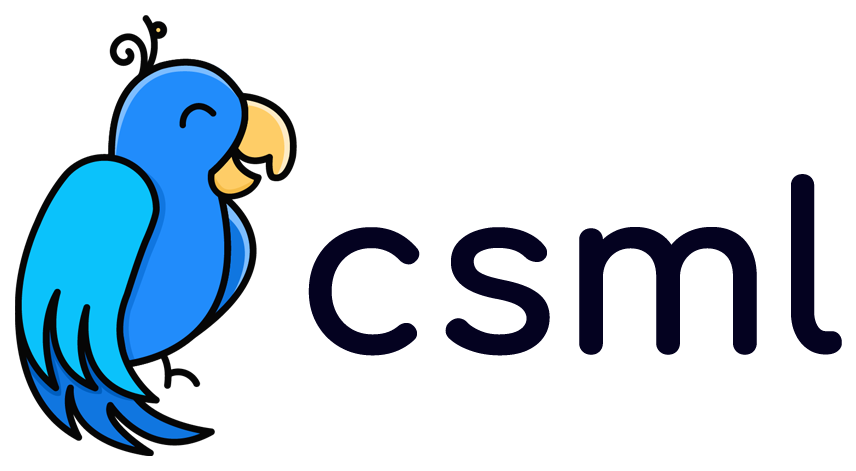
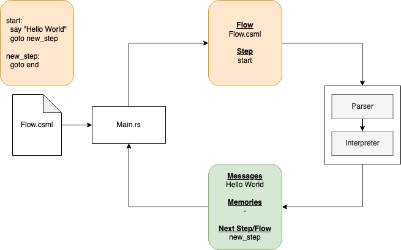

# CSML Language Interpreter



## Functional diagram



## Examples

### Hello World

    cargo run --example hello_world

### Event

    cargo run --example event

### Metadata

    cargo run --example metadata

### Memory

    cargo run --example memory

## Quick Start run it yourself

 requires Rust version 1.41.

```rust
use csmlinterpreter::data::csml_bot::CsmlBot;
use csmlinterpreter::data::csml_flow::CsmlFlow;
use csmlinterpreter::data::event::Event;
use csmlinterpreter::data::ContextJson;
use csmlinterpreter::interpret;
use csmlinterpreter::validate_bot;

const DEFAULT_ID_NAME: &str = "id";
const DEFAULT_FLOW_NAME: &str = "flow";
const DEFAULT_STEP_NAME: &str = "start";
const DEFAULT_BOT_NAME: &str = "my_bot";

////////////////////////////////////////////////////////////////////////////////
// PUBLIC FUNCTION
////////////////////////////////////////////////////////////////////////////////

fn main() {
    let content = std::fs::read_to_string("./hello_world.csml").unwrap();

    // Create a CsmlFlow
    let flow = CsmlFlow::new(
        DEFAULT_ID_NAME,
        DEFAULT_FLOW_NAME,
        &content,
        Vec::default()
    );

    // Create a CsmlBot
    let bot = CsmlBot::new(
        DEFAULT_ID_NAME,
        DEFAULT_BOT_NAME,
        None,
        vec![flow],
        DEFAULT_FLOW_NAME,
    );

    // Create an Event
    let event = Event::default();

    // Create a Context
    let context = ContextJson::new(
        serde_json::json!({}),
        serde_json::json!({}),
        None,
        None,
        DEFAULT_STEP_NAME,
        DEFAULT_FLOW_NAME,
    );

    // Run interpreter
    let result = validate_bot(bot.to_owned());

    if result.errors.is_some() {
        dbg!(result.errors);
        return;
    }
    if result.warnings.is_some() {
        dbg!(result.warnings);
    }

    dbg!(interpret(bot, context, event, None));
}
```
